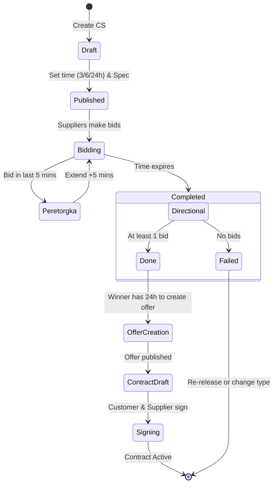

# User Story Scheme: Procurement Portal (Customer Role)

This document provides a structured representation of user requirements based on the "Customer Portal Instruction".

## 1. Actor Definitions

| Actor | Description |
| :--- | :--- |
| **System Administrator (Customer)** | Manages organizational data, user permissions, and budget limits imported from EIU. |
| **Procurement Specialist** | Responsible for finding products in the catalog, managing the cart, and initiating procurement procedures (Direct, Quote Sessions, ZPP). |
| **Contract Manager / Signatory** | Has Electronic Signature (ES) rights. Responsible for signing offers and contracts to finalize the purchase. |

---

## 2. User Story Map

### Core Navigation & Profile
- **As a Customer,** I want to **manage my company profile** so that suppliers see accurate registration and contact info.
- **As a Customer,** I want to **import budget limits from EIS** so that I can track spending for "special" procurements.
- **As a Customer,** I want to **receive notifications** (in-app and via calendar) so that I don't miss task deadlines (e.g., signing a contract).

### Product Discovery (Catalog & Cart)
- **As a Procurement Specialist,** I want to **search the CTE catalog** using filters (region, categories) so that I can find required goods or services.
- **As a Procurement Specialist,** I want to **add offers to my cart** so that I can group items for a single procurement request.

### Procurement Methods
- **As a Procurement Specialist,** I want to **create a Direct Purchase** for specific items in my cart so that I can quickly buy from a known supplier.
- **As a Procurement Specialist,** I want to **launch a Quote Session (CS)** for 3, 6, or 24 hours so that I can get the best price through competitive bidding.
- **As a Procurement Specialist,** I want to **publish a "Needs-based" (ZPP) request** so that suppliers can propose products even if they aren't in the catalog.
- **As a Procurement Specialist,** I want to **initiate a Joint Quote Session** so that multiple customers can aggregate their volumes to get better prices.
- **As a Procurement Specialist,** I want to **conduct procurement with Unknown Volume** (price per unit) when the exact quantity needed is not pre-determined.

### Contracting
- **As a Signatory,** I want to **sign a contract/offer** using my ES so that the purchase becomes legally binding.
- **As a Customer,** I want to **track contract statuses** (Draft, Signing, Active) so that I can monitor the fulfillment progress.

---

## 3. Process Flow (Quote Session & Contract)

The Quote Session (Котировочная сессия) is the most complex competitive flow.

---

## 4. Key Transition Statuses (Direct Purchase)

| From Status | To Status | Action / Trigger |
| :--- | :--- | :--- |
| **Draft (Черновик)** | **New (Новая)** | Customer clicks "Send to Supplier" |
| **New (Новая)** | **Confirmed (Подтверждена)** | Supplier confirms the request |
| **Confirmed** | **Contract (Контракт)** | Procedure for contract signing starts |
| **New** | **Rejected (Отклонена)** | Supplier rejects the request |

---

## 5. Detailed User Story Example: Quote Session

**User Story:** Launching a Quote Session
- **As a** Procurement Specialist
- **I want to** configure a Quote Session with specific durations and specifications
- **So that** I can obtain the lowest market price for a standard product.

**Acceptance Criteria:**
1. System allows selecting 3, 6, or 24-hour duration.
2. System automatically calculates NMCC (Initial Max Price) based on specification lines.
3. If a bid is placed in the last 5 minutes, "Peretorgka" (extension) is triggered automatically.
4. If no bids are placed, status changes to "Failed".
5. The winner is the participant with the lowest bid at the time of expiration.
